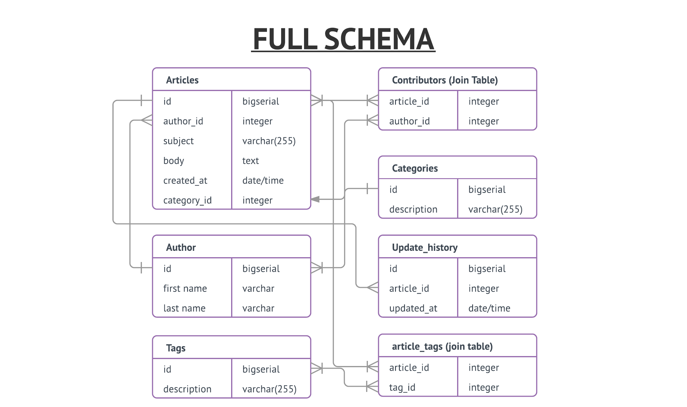
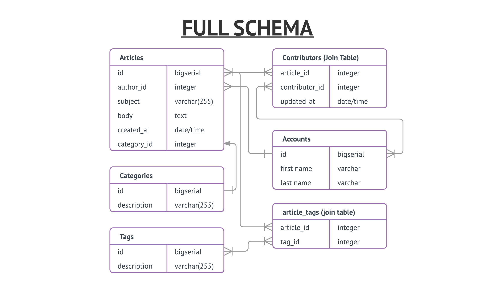

# Palmarius Wiki
### John Farrelly's Second WDI Project
----

A knowledge center for all things our cohort. Following wiki.app criteria on [the project instructions](https://git.generalassemb.ly/nyc-wdi-palmarius/palmarius-project-2/blob/master/wiki.md).

----
## Entity Relationship Diagram

**Notes on ERD**
- I'm planning my database schema ahead to include authors, categories, and tags in advance.
  - Tags are a reach, and the tags are their join table are set up that I can easily drop the concept if I don't like it.
- I've specifically designed each table to hold just one concept. That means I'm not jamming a category into the article table, because categories are their own thing.
- Using LucidChart again, and the special characters on the lines define the relationship between tables (not just signify that there is one!)

----

## Stories

- [Dev Stories on Pivotal Tracker Tracker](https://www.pivotaltracker.com/n/projects/2039931)

----

## Routes

| Routes        | READ        | CREATE  | UPDATE | DESTROY|
| ------------- |:-------------:| :----:| :----: | :-----: |
| `/`      | Collection of all articles | Creates new article in collection, redirects to new article | **X** | **X** |
| `/articles/:id `| Single article  | **X** | Edits part of article, redirects back to article | removes article from database, redirects to index |
| `/articles/new `| Form for creating new article, on submit, POST('/') | **X** | **X** | **X**
| `/articles/:id/edit `| Form for editing article, on submit, PATCH('/articles/:id') | **X** | **X** | **X**
| '/tags' | a collection of tags | *PLACEHOLDER, may not want to build this one out* | **X** | **X** |
| '/tags/id' | a listing of all articles with this tag |**X** | **X** | **X** |

----

## Wireframes

Check my notebook for right now.
